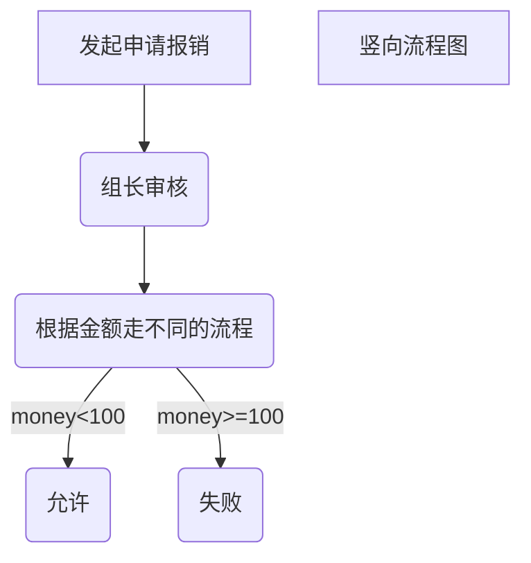

# Paddleflow用户使用手册
Please select the user documentation in your preferred language:
- [简体中文](zh_cn)
- [English](en)

```mermaid
graph TD
A[发起申请报销]-->B(组长审核)
B-->C(根据金额走不同的流程)
C--> |money<100| D(允许)
C--> |money>=100| E(失败)
G[竖向流程图]
```
